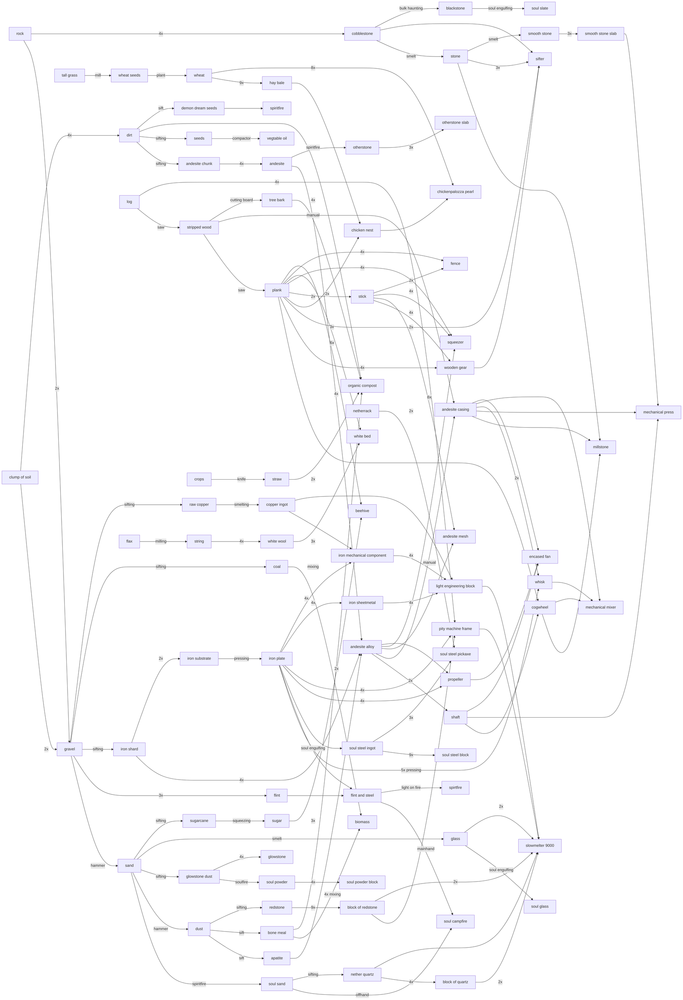

# FTB Skies Expert

```mermaid
%%{
init: {
"flowchart":{
"useMaxWidth": 0
}
}
}%%

graph LR

%% soul sand 
clump_of_soil[clump of soil] -->|2x| gravel
gravel -->|hammer| sand
sand -->|spiritfire| soul_sand[soul sand]
rock -->|2x| gravel
gravel -->|3x| flint

%% stone
rock -->|4x| cobblestone
cobblestone -->|smelt| stone

%% andesite alloy
iron_shard[iron shard] -->|4x| andesite_alloy[andesite alloy]
andesite -->|4x| andesite_alloy
apatite --> andesite_alloy

%% andesite
andesite_chunk[andesite chunk] -->|4x| andesite
dirt -->|sifting| andesite_chunk
clump_of_soil[clump of soil] -->|4x| dirt

%% apatite
dust -->|sift| apatite

%% planks
stripped_wood[stripped wood] -->|saw| plank
log -->|saw| stripped_wood

%% shaft
andesite_alloy -->|2x| shaft

%% cogwheel
shaft --> cogwheel
plank --> cogwheel

%% andesite casing
stripped_wood -->|manual| andesite_casing[andesite casing]
andesite_alloy -->|manual| andesite_casing

%% millstone
cogwheel --> millstone
andesite_casing --> millstone
stone -->  millstone

%% wooden gear
plank -->|4x| wooden_gear[wooden gear]
stick -->|4x| wooden_gear

%% sifter
plank -->|2x| sifter
cobblestone --> sifter
wooden_gear --> sifter
stone -->|3x| sifter

%% andesite mesh
stick -->|8x| andesite_mesh[andesite mesh]
andesite_alloy --> andesite_mesh

%% wheat
wheat_seeds[wheat seeds] -->|plant| wheat
tall_grass[tall grass] -->|mill| wheat_seeds

%% hay bale
wheat -->|9x| hay_bale[hay bale]

%% chicken nest
plank -->|2x| chicken_nest[chicken nest]
hay_bale --> chicken_nest

%% chickenpalozza pearl
wheat -->|8x| chickenpalozza_pearl[chickenpalozza pearl]
chicken_nest --> chickenpalozza_pearl

%% dust
sand -->|hammer| dust

%% bone meal
dust -->|sift| bone_meal[bone meal]

%% stick
plank -->|2x| stick

%% smooth stone slab
smooth_stone[smooth stone] -->|3x| smooth_stone_slab[smooth stone slab]
stone -->|smelt| smooth_stone

%% mechanical press
shaft --> mechanical_press[mechanical press]
andesite_casing --> mechanical_press
smooth_stone_slab[smooth stone slab] --> mechanical_press

%% squeezer
stick -->|4x| squeezer
plank -->|4x| squeezer
andesite_alloy --> squeezer

%% white wool
string -->|4x| white_wool[white wool]

%% white bed
white_wool -->|3x| white_bed[white bed]
plank -->|3x| white_bed

%% iron shard
gravel -->|sifting| iron_shard[iron shard]

%% iron substrate
iron_shard -->|2x| iron_substrate[iron substrate]

%% iron plate
iron_substrate -->|pressing| iron_plate[iron plate]

%% whisk
iron_plate -->|5x pressing| whisk
andesite_casing -->|2x| whisk

%% mechancal mixer
cogwheel --> mechanical_mixer[mechanical mixer]
andesite_casing --> mechanical_mixer
whisk --> mechanical_mixer

%% fence
stick -->|2x| fence
plank -->|4x| fence

%% coal
gravel -->|sifting| coal

%% biomass
bone_meal -->|4x mixing| biomass
coal -->|mixing| biomass

%% seeds
dirt -->|sifting| seeds

%% vegtable oil
seeds -->|compactor| vegtable_oil[vegtable oil]

%% glowstone dust
sand -->|sifting| glowstone_dust[glowstone dust]

%% tree bark
stripped_wood -->|cutting board| tree_bark[tree bark]

%% straw
crops -->|knife| straw

%% organic compost
dirt --> organic_compost[organic compost]
straw -->|2x| organic_compost
bone_meal -->|2x| organic_compost
tree_bark -->|4x| organic_compost

%% string
flax -->|milling| string

%% soul campfire
flint_and_steel[flint and steel] -->|mainhand| soul_campfire[soul campfire]
soul_sand -->|offhand| soul_campfire

%% flint and steel
flint --> flint_and_steel
iron_plate --> flint_and_steel

%% demon dream seeds
dirt -->|sift| demon_dream_seeds[demon dream seeds]
%% spiritfire
flint_and_steel -->|light on fire| spirtfire
demon_dream_seeds --> spiritfire

%% otherstone
andesite -->|spiritfire| otherstone

%% otherstone slab
otherstone -->|3x| otherstone_slab[otherstone slab]

%% soul powder
glowstone_dust -->|soulfire| soul_powder[soul powder]

%% soul powder block
soul_powder -->|4x| soul_powder_block[soul powder block]

%% glowstone
glowstone_dust -->|4x| glowstone

%% glass
sand -->|smelt| glass

%% soul glass
glass -->|soul engulfing| soul_glass[soul glass]

%% soul steel ingot
iron_plate -->|soul engulfing| soul_steel_ingot[soul steel ingot]

%% soul steel block
soul_steel_ingot -->|9x| soul_steel_block[soul steel block]

%% blackstone
cobblestone -->|bulk haunting| blackstone

%% soul slate
blackstone -->|soul engulfing| soul_slate[soul slate]

%% propeller
iron_plate -->|4x| propeller
andesite_alloy --> propeller

%% encased fan
shaft --> encased_fan[encased fan]
andesite_casing --> encased_fan
propeller --> encased_fan

%% sugarcane
sand -->|sifting| sugarcane

%% sugar
sugarcane -->|squeezing| sugar

%% beehive
sugar -->|3x| beehive
plank -->|6x| beehive

%% soul steel pickaxe
soul_steel_ingot -->|3x| soul_steel_pickaxe[soul steel pickaxe]
netherrack -->|2x| soul_steel_pickaxe

%% redstone
dust -->|sifting| redstone

%% nether quartz
soul_sand -->|sifting| nether_quartz[nether quartz]

%% block of quartz
nether_quartz -->|4x| block_of_quartz[block of quartz] 

%% block of redstone
redstone -->|9x| block_of_redstone[block of redstone]

%% pity machine frame
log -->|4x| pity_machine_frame[pity machine frame]
iron_plate -->|4x| pity_machine_frame
block_of_redstone --> pity_machine_frame

%% raw copper
gravel -->|sifting| raw_copper[raw copper]

%% copper ingot
raw_copper -->|smelting| copper_ingot[copper ingot]

%% iron sheetmetal
iron_plate -->|4x| iron_sheetmetal[iron sheetmetal]

%% iron mechanical component
iron_plate -->|4x| iron_mechanical_component[iron mechanical component]
copper_ingot --> iron_mechanical_component

%% light engineering block
copper_ingot --> light_engineering_block[light engineering block]
iron_mechanical_component -->|4x| light_engineering_block
iron_sheetmetal -->|4x| light_engineering_block

%% slowmelter 9000
block_of_redstone -->|2x| slowmelter_9000[slowmelter 9000]
nether_quartz --> slowmelter_9000
glass -->|2x| slowmelter_9000
block_of_quartz -->|2x| slowmelter_9000
pity_machine_frame --> slowmelter_9000
light_engineering_block --> slowmelter_9000


%% ########## BEEEHIVE STUFF
%% honeycomb
%% shears
%% campfire
%% advanced beehive
%% expansion box

%% ##### anvil stuff
%% iron ingot
%% block of iron
%% iron_ingot -->|9x| block_of_iron[block of iron]
%% anvil
%% block_of_iron -->|3x| anvil
%% iron_plate -->|4x| anvil
%% netherrack

%%linkStyle 2,4,6,8,10,12,14,16,18,20,22,24,26,28,30,32,34,36,38 stroke:blue
%%linkStyle 1,3,5,7,9,11,13,15,17,19,21,23,25,27,29,31,33,35,37 stroke:red
```
