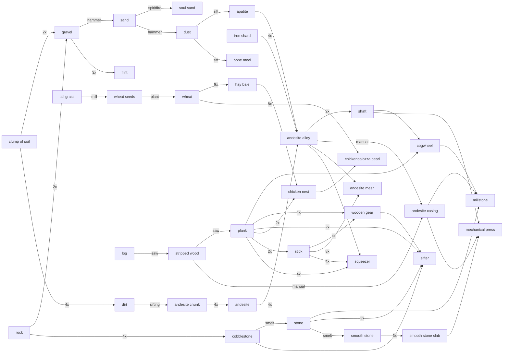

# FTB Skies Expert

```mermaid
graph LR

%% soul sand 
clump_of_soil[clump of soil] -->|2x| gravel
gravel -->|hammer| sand
sand -->|spiritfire| soul_sand[soul sand]
rock -->|2x| gravel
gravel -->|3x| flint

%% stone
rock -->|4x| cobblestone
cobblestone -->|smelt| stone

%% andesite alloy
iron_shard[iron shard] -->|4x| andesite_alloy[andesite alloy]
andesite -->|4x| andesite_alloy
apatite --> andesite_alloy

%% andesite
andesite_chunk[andesite chunk] -->|4x| andesite
dirt -->|sifting| andesite_chunk
clump_of_soil[clump of soil] -->|4x| dirt

%% apatite
dust -->|sift| apatite

%% planks
stripped_wood[stripped wood] -->|saw| plank
log -->|saw| stripped_wood

%% shaft
andesite_alloy -->|2x| shaft

%% cogwheel
shaft --> cogwheel
plank --> cogwheel

%% andesite casing
stripped_wood -->|manual| andesite_casing[andesite casing]
andesite_alloy -->|manual| andesite_casing

%% millstone
cogwheel --> millstone
andesite_casing --> millstone
stone -->  millstone

%% wooden gear
plank -->|4x| wooden_gear[wooden gear]
stick -->|4x| wooden_gear

%% sifter
plank -->|2x| sifter
cobblestone --> sifter
wooden_gear --> sifter
stone -->|3x| sifter

%% andesite mesh
stick -->|8x| andesite_mesh[andesite mesh]
andesite_alloy --> andesite_mesh

%% wheat
wheat_seeds[wheat seeds] -->|plant| wheat
tall_grass[tall grass] -->|mill| wheat_seeds

%% hay bale
wheat -->|9x| hay_bale[hay bale]

%% chicken nest
plank -->|2x| chicken_nest[chicken nest]
hay_bale --> chicken_nest

%% chickenpalozza pearl
wheat -->|8x| chickenpalozza_pearl[chickenpalozza pearl]
chicken_nest --> chickenpalozza_pearl

%% dust
sand -->|hammer| dust

%% bone meal
dust -->|sift| bone_meal[bone meal]

%% stick
plank -->|2x| stick

%% smooth stone slab
smooth_stone[smooth stone] -->|3x| smooth_stone_slab[smooth stone slab]
stone -->|smelt| smooth_stone

%% mechanical press
shaft --> mechanical_press[mechanical press]
andesite_casing --> mechanical_press
smooth_stone_slab[smooth stone slab] --> mechanical_press

%% squeezer
stick -->|4x| squeezer
plank -->|4x| squeezer
andesite_alloy --> squeezer


%%linkStyle 2,4,6,8,10,12,14,16,18,20,22,24,26,28,30,32,34,36,38 stroke:blue
%%linkStyle 1,3,5,7,9,11,13,15,17,19,21,23,25,27,29,31,33,35,37 stroke:red

```
