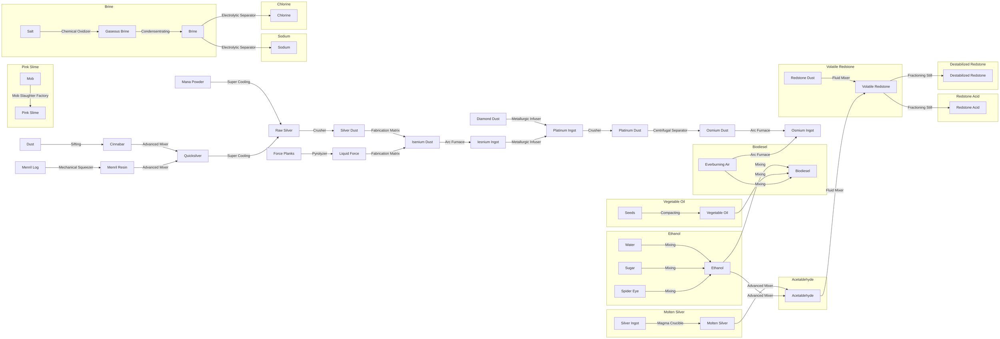

# FTB Skies Expert

```mermaid
%%{
init: {
"flowchart":{
"useMaxWidth": 0
}
}
}%%

graph LR

%% BEGIN OSMIUM INGOT

%% Osmium Ingot
osmium_dust[Osmium Dust] -->|Arc Furnace| osmium_ingot[Osmium Ingot]
everburning_air[Everburning Air] -->|Arc Furnace| osmium_ingot

%% Osmium Dust
platinum_dust[Platinum Dust] -->|Centrifugal Separator| osmium_dust

%% Platnium Dust
platinum_ingot[Platinum Ingot] -->|Crusher| platinum_dust

%% Platinum Ingot
iesnium_ingot[Iesnium Ingot] -->|Metallurgic Infuser| platinum_ingot
diamond_dust[Diamond Dust] -->|Metallurgic Infuser| platinum_ingot

%% Iesnium Ingot
isenium_dust[Isenium Dust] -->|Arc Furnace| iesnium_ingot

%% Isenium Dust
liquid_force[Liquid Force] -->|Fabrication Matrix| isenium_dust
silver_dust[Silver Dust] -->|Fabrication Matrix| isenium_dust

%% Liquid Force
force_planks[Force Planks] -->|Pyrolyzer| liquid_force

%% Silver Dust
raw_silver[Raw Silver] -->|Crusher| silver_dust

%% Raw Silver
quicksilver[Quicksilver] -->|Super Cooling| raw_silver
mana_powder[Mana Powder] -->|Super Cooling| raw_silver

%% Quicksilver
menril_resin[Menril Resin] -->|Advanced Mixer| quicksilver
cinnabar[Cinnabar] -->|Advanced Mixer| quicksilver

%% Menril Resin
menril_log[Menril Log] -->|Mechanical Squeezer| menril_resin

%% Cinnabar
dust[Dust] -->|Sifting| cinnabar

%% END OSMIUM INGOT

%% BEGIN FLUIDS

subgraph Ethanol
spider_eye[Spider Eye] -->|Mixing| ethanol[Ethanol]
sugar[Sugar] -->|Mixing| ethanol
water[Water] -->|Mixing| ethanol
end

subgraph Molten Silver
silver_ingot[Silver Ingot] -->|Magma Crucible| molten_silver
end

subgraph Acetaldehyde
ethanol[Ethanol] -->|Advanced Mixer| acetaldehyde[Acetaldehyde]
molten_silver[Molten Silver] -->|Advanced Mixer| acetaldehyde
end

subgraph Vegetable Oil
seeds[Seeds] -->|Compacting| vegetable_oil
end

subgraph Biodiesel
everburning_air[Everburning Air] -->|Mixing| biodiesel[Biodiesel]
vegetable_oil[Vegetable Oil] -->|Mixing| biodiesel
ethanol -->|Mixing| biodiesel
end

subgraph Pink Slime
mob[Mob] -->|Mob Slaughter Factory| pink_slime[Pink Slime]
end

subgraph Brine
salt[Salt] -->|Chemical Oxidizer| gaseous_brine[Gaseous Brine]
gaseous_brine -->|Condensentrating| brine[Brine]
end

subgraph Sodium
brine -->|Electrolytic Separator| sodium[Sodium]
end

subgraph Chlorine
brine -->|Electrolytic Separator| chlorine[Chlorine]
end

subgraph Volatile Redstone
acetaldehyde -->|Fluid Mixer| volatile_redstone[Volatile Redstone]
redstone_dust[Redstone Dust] -->|Fluid Mixer| volatile_redstone[Volatile Redstone]
end

subgraph Destabilized Redstone
volatile_redstone -->|Fractioning Still| destabilized_redstone[Destabilized Redstone]
end

subgraph Redstone Acid
volatile_redstone -->|Fractioning Still| redstone_acid[Redstone Acid]
end

%% END FLUIDS
```
