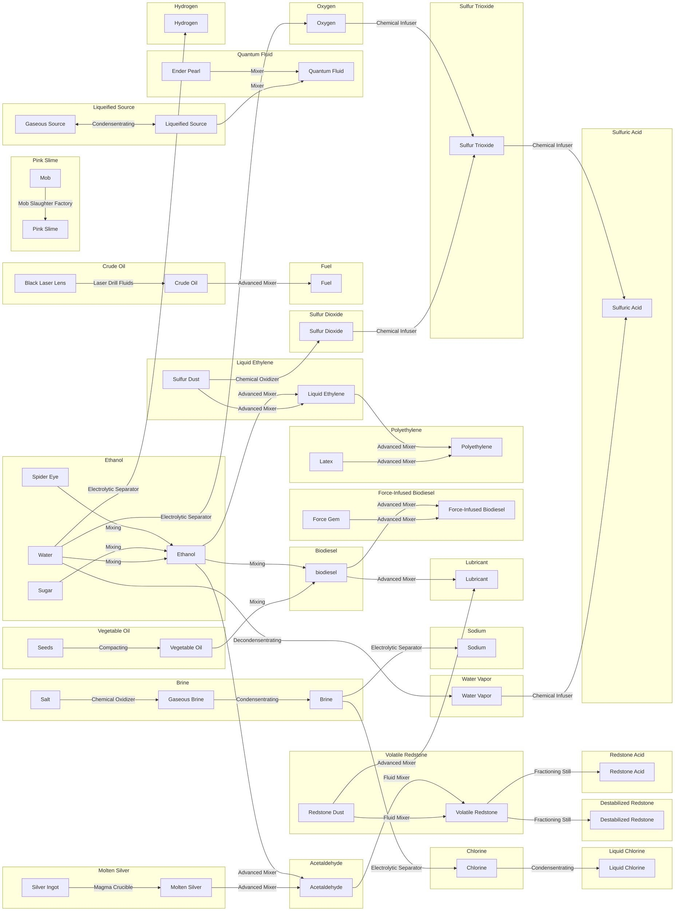

# Fluids and Liquids

```mermaid
%%{
init: {
"flowchart":{
"useMaxWidth": 0
}
}
}%%

graph LR

subgraph Ethanol
spider_eye[Spider Eye] -->|Mixing| ethanol[Ethanol]
sugar[Sugar] -->|Mixing| ethanol
water[Water] -->|Mixing| ethanol
end

subgraph Molten Silver
silver_ingot[Silver Ingot] -->|Magma Crucible| molten_silver
end

subgraph Acetaldehyde
ethanol[Ethanol] -->|Advanced Mixer| acetaldehyde[Acetaldehyde]
molten_silver[Molten Silver] -->|Advanced Mixer| acetaldehyde
end

subgraph Vegetable Oil
seeds[Seeds] -->|Compacting| vegetable_oil[Vegetable Oil]
end

subgraph Biodiesel
ethanol -->|Mixing| biodiesel
vegetable_oil -->|Mixing| biodiesel
end

subgraph Pink Slime
mob[Mob] -->|Mob Slaughter Factory| pink_slime[Pink Slime]
end

subgraph Brine
salt[Salt] -->|Chemical Oxidizer| gaseous_brine[Gaseous Brine]
gaseous_brine -->|Condensentrating| brine[Brine]
end

subgraph Sodium
brine -->|Electrolytic Separator| sodium[Sodium]
end

subgraph Chlorine
brine -->|Electrolytic Separator| chlorine[Chlorine]
end

subgraph Liquid Chlorine
chlorine -->|Condensentrating| liquid_chlorine[Liquid Chlorine]
end

subgraph Volatile Redstone
acetaldehyde -->|Fluid Mixer| volatile_redstone[Volatile Redstone]
redstone_dust[Redstone Dust] -->|Fluid Mixer| volatile_redstone[Volatile Redstone]
end

subgraph Destabilized Redstone
volatile_redstone -->|Fractioning Still| destabilized_redstone[Destabilized Redstone]
end

subgraph Redstone Acid
volatile_redstone -->|Fractioning Still| redstone_acid[Redstone Acid]
end

subgraph Lubricant
biodiesel -->|Advanced Mixer| lubricant[Lubricant]
redstone_dust -->|Advanced Mixer| lubricant
end

subgraph Force-Infused Biodiesel
biodiesel -->|Advanced Mixer| force_infused_biodiesel[Force-Infused Biodiesel]
force_gem[Force Gem] -->|Advanced Mixer| force_infused_biodiesel
end

subgraph Liqueified Source
gaseous_source[Gaseous Source] <-->|Condensentrating| liqueified_source[Liqueified Source]
end

subgraph Crude Oil
black_laser_lens[Black Laser Lens] -->|Laser Drill Fluids| crude_oil[Crude Oil]
end

subgraph Fuel
crude_oil -->|Advanced Mixer| fuel[Fuel]
end

subgraph Liquid Ethylene
ethanol -->|Advanced Mixer| liquid_ethylene[Liquid Ethylene]
sulfur_dust[Sulfur Dust] -->|Advanced Mixer| liquid_ethylene
end

subgraph Polyethylene
liquid_ethylene -->|Advanced Mixer| polyethylene[Polyethylene]
latex[Latex] -->|Advanced Mixer| polyethylene
end

subgraph Quantum Fluid
ender_pearl[Ender Pearl] -->|Mixer| quantum_fluid[Quantum Fluid]
liqueified_source[Liqueified Source] -->|Mixer| quantum_fluid
end

subgraph Oxygen
water -->|Electrolytic Separator| oxygen[Oxygen]
end

subgraph Hydrogen
water -->|Electrolytic Separator| hydrogen[Hydrogen]
end

subgraph Sulfur Dioxide
sulfur_dust -->|Chemical Oxidizer| sulfur_dioxide[Sulfur Dioxide]
end

subgraph Sulfur Trioxide
oxygen -->|Chemical Infuser| sulfur_trioxide[Sulfur Trioxide]
sulfur_dioxide -->|Chemical Infuser| sulfur_trioxide
end

subgraph Water Vapor
water -->|Decondensentrating| water_vapor[Water Vapor]
end

subgraph Sulfuric Acid
sulfur_trioxide -->|Chemical Infuser| sulfuric_acid[Sulfuric Acid]
water_vapor -->|Chemical Infuser| sulfuric_acid
end
```
