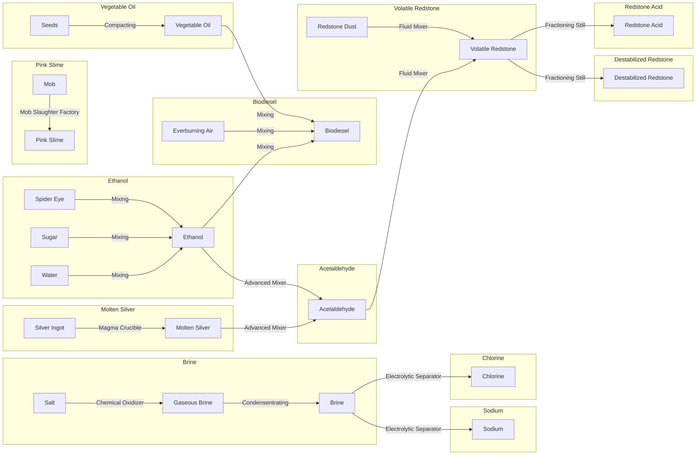

# FTB Skies Expert

```mermaid
%%{
init: {
"flowchart":{
"useMaxWidth": 0
}
}
}%%

graph LR

subgraph Ethanol
spider_eye[Spider Eye] -->|Mixing| ethanol[Ethanol]
sugar[Sugar] -->|Mixing| ethanol
water[Water] -->|Mixing| ethanol
end

subgraph Molten Silver
silver_ingot[Silver Ingot] -->|Magma Crucible| molten_silver
end

subgraph Acetaldehyde
ethanol[Ethanol] -->|Advanced Mixer| acetaldehyde[Acetaldehyde]
molten_silver[Molten Silver] -->|Advanced Mixer| acetaldehyde
end

subgraph Vegetable Oil
seeds[Seeds] -->|Compacting| vegetable_oil
end

subgraph Biodiesel
everburning_air[Everburning Air] -->|Mixing| biodiesel[Biodiesel]
vegetable_oil[Vegetable Oil] -->|Mixing| biodiesel
ethanol -->|Mixing| biodiesel
end

subgraph Pink Slime
mob[Mob] -->|Mob Slaughter Factory| pink_slime[Pink Slime]
end

subgraph Brine
salt[Salt] -->|Chemical Oxidizer| gaseous_brine[Gaseous Brine]
gaseous_brine -->|Condensentrating| brine[Brine]
end

subgraph Sodium
brine -->|Electrolytic Separator| sodium[Sodium]
end

subgraph Chlorine
brine -->|Electrolytic Separator| chlorine[Chlorine]
end

subgraph Volatile Redstone
acetaldehyde -->|Fluid Mixer| volatile_redstone[Volatile Redstone]
redstone_dust[Redstone Dust] -->|Fluid Mixer| volatile_redstone[Volatile Redstone]
end

subgraph Destabilized Redstone
volatile_redstone -->|Fractioning Still| destabilized_redstone[Destabilized Redstone]
end

subgraph Redstone Acid
volatile_redstone -->|Fractioning Still| redstone_acid[Redstone Acid]
end
```
