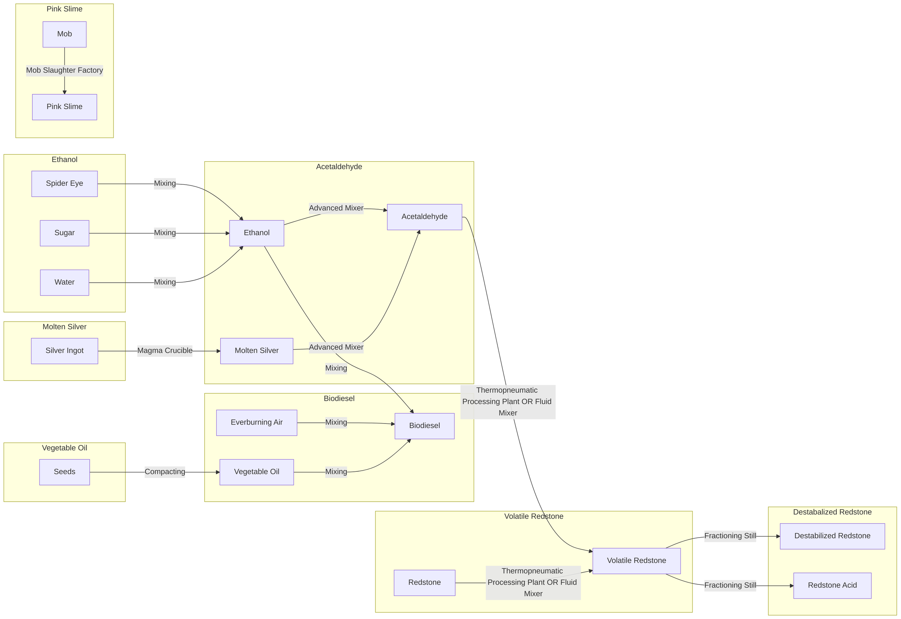

# FTB Skies Expert

```mermaid
%%{
init: {
"flowchart":{
"useMaxWidth": 0
}
}
}%%

graph LR

subgraph Acetaldehyde
ethanol[Ethanol] -->|Advanced Mixer| acetaldehyde[Acetaldehyde]
molten_silver[Molten Silver] -->|Advanced Mixer| acetaldehyde
end

subgraph Ethanol
spider_eye[Spider Eye] -->|Mixing| ethanol[Ethanol]
sugar[Sugar] -->|Mixing| ethanol
water[Water] -->|Mixing| ethanol
end

subgraph Molten Silver
silver_ingot[Silver Ingot] -->|Magma Crucible| molten_silver
end

subgraph Biodiesel
everburning_air[Everburning Air] -->|Mixing| biodiesel[Biodiesel]
vegetable_oil[Vegetable Oil] -->|Mixing| biodiesel
ethanol -->|Mixing| biodiesel
end

subgraph Vegetable Oil
seeds[Seeds] -->|Compacting| vegetable_oil
end

subgraph Pink Slime
mob[Mob] -->|Mob Slaughter Factory| pink_slime[Pink Slime]
end


subgraph Volatile Redstone
acetaldehyde -->|Thermopneumatic Processing Plant OR Fluid Mixer| volatile_redstone[Volatile Redstone]
redstone[Redstone] -->|Thermopneumatic Processing Plant OR Fluid Mixer| volatile_redstone[Volatile Redstone]
end

subgraph Destabalized Redstone
volatile_redstone -->|Fractioning Still| destabilized_redstone[Destabilized Redstone]
volatile_redstone -->|Fractioning Still| redstone_acid[Redstone Acid]
end
```
