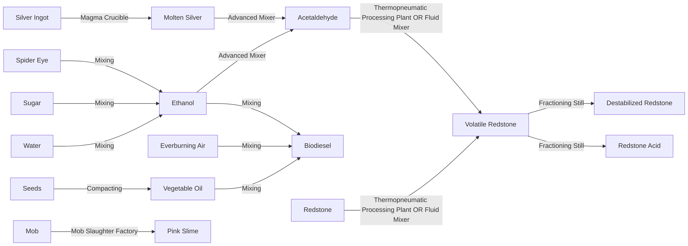

# FTB Skies Expert

```mermaid
%%{
init: {
"flowchart":{
"useMaxWidth": 0
}
}
}%%

graph LR

%% acetaldehyde
ethanol[Ethanol] -->|Advanced Mixer| acetaldehyde[Acetaldehyde]
molten_silver[Molten Silver] -->|Advanced Mixer| acetaldehyde

%% ethanol
spider_eye[Spider Eye] -->|Mixing| ethanol[Ethanol]
sugar[Sugar] -->|Mixing| ethanol
water[Water] -->|Mixing| ethanol

%% molten silver
silver_ingot[Silver Ingot] -->|Magma Crucible| molten_silver

%% biodiesel
everburning_air[Everburning Air] -->|Mixing| biodiesel[Biodiesel]
vegetable_oil[Vegetable Oil] -->|Mixing| biodiesel
ethanol -->|Mixing| biodiesel

%% vegetable oil
seeds[Seeds] -->|Compacting| vegetable_oil

%% pink slime
mob[Mob] -->|Mob Slaughter Factory| pink_slime[Pink Slime]

%% volatile redstone
acetaldehyde -->|Thermopneumatic Processing Plant OR Fluid Mixer| volatile_redstone[Volatile Redstone]
redstone[Redstone] -->|Thermopneumatic Processing Plant OR Fluid Mixer| volatile_redstone[Volatile Redstone]

%% destabilized redstone
%% redstone acid
volatile_redstone -->|Fractioning Still| destabilized_redstone[Destabilized Redstone]
volatile_redstone -->|Fractioning Still| redstone_acid[Redstone Acid]
```
