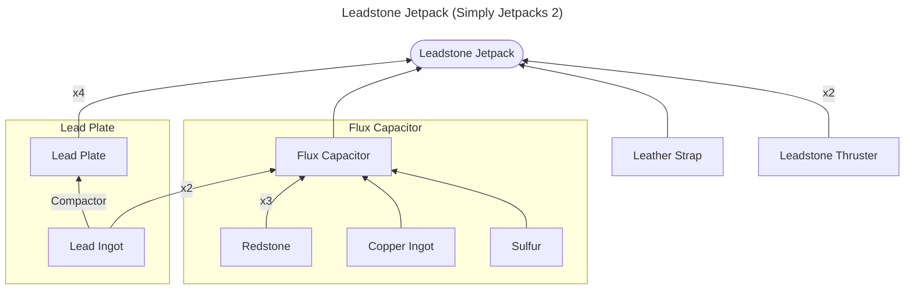

```mermaid
---
title: Leadstone Jetpack (Simply Jetpacks 2)
---

flowchart BT

leadstone-jetpack([Leadstone Jetpack])

%% Tier 1
lead-plate[Lead Plate] --> |x4| leadstone-jetpack
flux-capacitor[Flux Capacitor] --> leadstone-jetpack
leather-strap[Leather Strap] --> leadstone-jetpack
leadstone-thruster[Leadstone Thruster]--> |x2| leadstone-jetpack

%% Lead Plate
subgraph sg-lead-plate [Lead Plate]
    lead-ingot[Lead Ingot] --> |Compactor| lead-plate
end

%% Flux Capacitor
subgraph sg-flux-capacitor [Flux Capacitor]
    lead-ingot --> |x2| flux-capacitor
    redstone[Redstone] --> |x3| flux-capacitor
    copper-ingot[Copper Ingot] --> flux-capacitor
    sulfur[Sulfur] --> flux-capacitor
end
    

```
