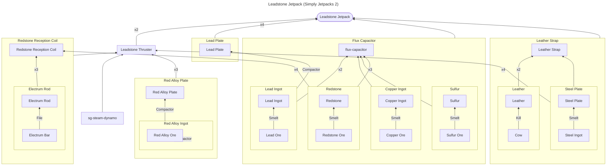

```mermaid
---
title: Leadstone Jetpack (Simply Jetpacks 2)
---

flowchart BT


leadstone-jetpack([Leadstone Jetpack])

%% Tier 1
%%%%%%%%%%%%%%%%%%%%%%%%%%%%%%%%%%%%%%%
sg-lead-plate[Lead Plate] --> |x4| leadstone-jetpack
sg-flux-capacitor[Flux Capacitor] --> leadstone-jetpack
sg-leather-strap[Leather Strap] --> leadstone-jetpack
sg-leadstone-thruster[Leadstone Thruster]--> |x2| leadstone-jetpack

%% Flux Capacitor
subgraph sg-flux-capacitor [Flux Capacitor]
    sg-lead-ingot --> |x2| flux-capacitor
    sg-copper-ingot --> flux-capacitor
    sg-sulfur --> flux-capacitor
    sg-redstone --> |x3| flux-capacitor
end


%% Leather Strap
subgraph sg-leather-strap [Leather Strap]
    direction BT
    sg-leather --> |x2| leather-strap[Leather Strap]
    sg-steel-plate --> leather-strap[Leather Strap]
end

%% Leadstone Thruster
    subgraph sg-leadstone-thruster [Leadstone Thruster]
end


%% Lead Plate
%%%%%%%%%%%%%%%%%%%%%%%%%%%%%%%%%%%%%%%
%% Lead Ingot
subgraph sg-lead-ingot [Lead Ingot]
    direction BT
    lead-ore[Lead Ore] --> |Smelt| lead-ingot[Lead Ingot]
end

%% Lead Plate
subgraph sg-lead-plate [Lead Plate]
    sg-lead-ingot[Lead Ingot] --> |Compactor| lead-plate[Lead Plate]
end


%% Flux Capacitor
%%%%%%%%%%%%%%%%%%%%%%%%%%%%%%%%%%%%%%%
%% Redstone
subgraph sg-redstone [Redstone]
    direction BT
    redstone-ore[Redstone Ore] -->|Smelt| redstone[Redstone]
end


%% Copper Ingot
subgraph sg-copper-ingot [Copper Ingot]
    direction BT
    copper-ore[Copper Ore] --> |Smelt| copper-ingot[Copper Ingot]
end

%% Sulfur
subgraph sg-sulfur [Sulfur]
    direction BT
    sulfur-ore[Sulfur Ore] -->|Smelt| sulfur[Sulfur]
end

%% Leather Strap
%%%%%%%%%%%%%%%%%%%%%%%%%%%%%%%%%%%%%%%
subgraph sg-leather [Leather]
    direction BT
    cow[Cow] -->|Kill| leather[Leather]
end

subgraph sg-steel-plate [Steel Plate]
    direction BT
    sg-steel-ingot[Steel Ingot] -->|Smelt| steel-plate[Steel Plate]
end

%% Leadstone Thruster
%%%%%%%%%%%%%%%%%%%%%%%%%%%%%%%%%%%%%%%
sg-steel-plate --> |x4| sg-leadstone-thruster
sg-redstone-reception-coil --> sg-leadstone-thruster
sg-steam-dynamo --> sg-leadstone-thruster
sg-red-alloy-plate --> |x3| sg-leadstone-thruster


%% Red Alloy Plate
%%%%%%%%%%%%%%%%%%%%%%%%%%%%%%%%%%%%%%%
subgraph sg-red-alloy-plate [Red Alloy Plate]
    direction BT
    sg-red-alloy-ingot[Red Alloy Ingot] --> |Compactor| red-alloy-plate[Red Alloy Plate]
end

subgraph sg-red-alloy-ingot [Red Alloy Ingot]
   direction BT
   red-alloy-ore[Red Alloy Ore] --> |Compactor| sg-red-alloy-ingot[Red Alloy Ingot]
end

subgraph sg-redstone-reception-coil [Redstone Reception Coil]
    direction BT
    sg-electrum-rod[Electrum Rod] --> |x3| redstone-reception-coil[Redstone Reception Coil]
    sg-redstone[Redstone] --> |x4| redstone-reception-coil[Redstone Reception Coil]
end

subgraph sg-electrum-rod [Electrum Rod]
    direction BT
    sg-electrum-bar[Electrum Bar] --> |File| electrum-rod[Electrum Rod]
end

```
