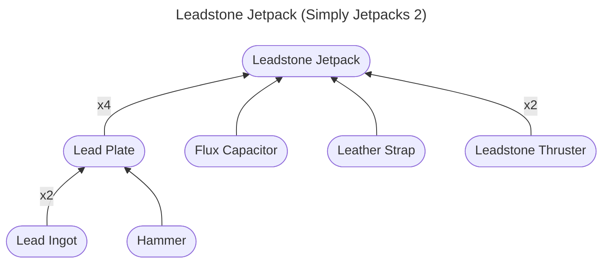

```mermaid
---
title: Leadstone Jetpack (Simply Jetpacks 2)
---

flowchart BT

leadstone-jetpack([Leadstone Jetpack])

lead-plate([Lead Plate])
flux-capacitor([Flux Capacitor])
leather-strap([Leather Strap])
leadstone-thruster([Leadstone Thruster])

lead-ingot([Lead Ingot])
hammer([Hammer])

%% Tier 1
lead-plate --> |x4| leadstone-jetpack
flux-capacitor --> leadstone-jetpack
leather-strap --> leadstone-jetpack
leadstone-thruster --> |x2| leadstone-jetpack

%% Lead Plate
lead-ingot --> |x2| lead-plate
hammer --> lead-plate

```
